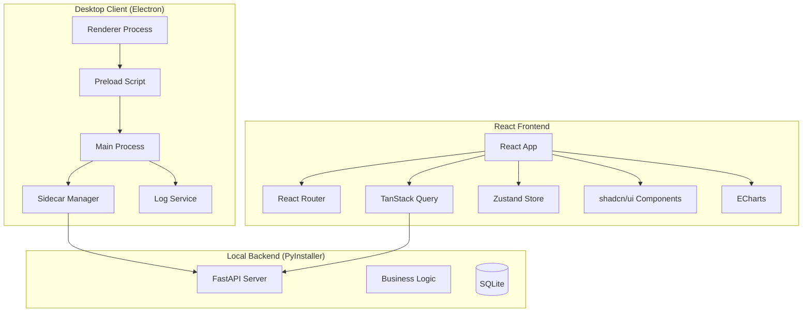

# Design Document: LifeFlow V2

## Overview

LifeFlow V2 是对现有应用的全面重构，采用现代化的 React 技术栈和精心设计的 UI 系统。本次重构分为以下阶段：

1. **项目结构重组**：将 V1 代码归档到 `lifeflow_v1` 目录，在新目录中开发 V2
2. **问题修复阶段**：彻底解决后端连接问题，建立可靠的 Sidecar 进程管理机制
3. **前端重构阶段**：使用 React 18 + Vite + Tailwind CSS + shadcn/ui 重建前端
4. **性能优化阶段**：优化启动速度、减小打包体积、提升运行性能
5. **测试验证阶段**：严密的前后端测试，确保打包后应用可用

### 开发体验改进

本次开发采用**渐进式开发模式**：
- 每完成一个功能模块，可在浏览器中预览和调试
- 使用 Vite 开发服务器，支持热更新
- 后端可独立运行，前端可在 Web 模式下开发
- 定期进行 Electron 集成测试，确保桌面端兼容性

## Architecture

### 系统架构图



### 技术栈决策

| 层级 | 技术选择 | 理由 |
|------|----------|------|
| 构建工具 | Vite | 极快的 HMR，原生 ESM 支持 |
| 前端框架 | React 18 | 生态成熟，shadcn/ui 原生支持 |
| 类型系统 | TypeScript | 类型安全，更好的开发体验 |
| 样式方案 | Tailwind CSS | 实用优先，快速开发 |
| 组件库 | shadcn/ui | 高质量、可定制、无依赖锁定 |
| 状态管理 | Zustand | 轻量、简洁、TypeScript 友好 |
| 数据获取 | TanStack Query | 缓存、重试、乐观更新 |
| 路由 | React Router v6 | 标准选择，嵌套路由支持 |
| 图表 | ECharts | 功能强大，动画效果好 |
| 桌面框架 | Electron | 跨平台，成熟稳定 |
| 后端 | FastAPI + PyInstaller | 已有实现，打包为独立可执行文件 |

## Components and Interfaces

### 项目目录结构

```
/
├── lifeflow_v1/             # V1 代码归档
│   ├── docs/
│   └── src/
│       ├── backend/
│       └── frontend/
├── src/                     # V2 代码
│   ├── backend/             # 后端（复用 V1，优化后）
│   └── frontend/            # React 前端
└── .kiro/specs/
```

### 前端目录结构

```
src/frontend/
├── src/
│   ├── components/          # 可复用组件
│   │   ├── ui/              # shadcn/ui 组件
│   │   ├── layout/          # 布局组件
│   │   │   ├── Sidebar.tsx
│   │   │   ├── Header.tsx
│   │   │   └── MainLayout.tsx
│   │   ├── task/            # 任务相关组件
│   │   │   ├── TaskCard.tsx
│   │   │   ├── TaskList.tsx
│   │   │   ├── TaskEditor.tsx
│   │   │   └── TaskCreateForm.tsx
│   │   ├── habit/           # 习惯相关组件
│   │   │   ├── HabitCard.tsx
│   │   │   ├── HabitList.tsx
│   │   │   ├── StreakBadge.tsx
│   │   │   └── CheckinButton.tsx
│   │   ├── life/            # 生活记录组件
│   │   │   ├── LifeEntry.tsx
│   │   │   ├── Timeline.tsx
│   │   │   ├── EntryInput.tsx
│   │   │   └── DateSeparator.tsx
│   │   ├── stats/           # 统计组件
│   │   │   ├── DailyRing.tsx
│   │   │   ├── StatCard.tsx
│   │   │   ├── TrendChart.tsx
│   │   │   └── HeatmapCalendar.tsx
│   │   └── common/          # 通用组件
│   │       ├── ErrorBoundary.tsx
│   │       ├── LoadingSkeleton.tsx
│   │       ├── EmptyState.tsx
│   │       └── Toast.tsx
│   ├── pages/               # 页面组件
│   │   ├── HomePage.tsx
│   │   ├── TasksPage.tsx
│   │   ├── HabitsPage.tsx
│   │   ├── LifePage.tsx
│   │   ├── StatsPage.tsx
│   │   └── SettingsPage.tsx
│   ├── hooks/               # 自定义 Hooks
│   │   ├── useTasks.ts
│   │   ├── useHabits.ts
│   │   ├── useLifeEntries.ts
│   │   ├── useStats.ts
│   │   └── useSettings.ts
│   ├── stores/              # Zustand stores
│   │   ├── uiStore.ts
│   │   └── settingsStore.ts
│   ├── api/                 # API 客户端
│   │   ├── client.ts
│   │   ├── tasks.ts
│   │   ├── habits.ts
│   │   ├── lifeEntries.ts
│   │   └── stats.ts
│   ├── lib/                 # 工具函数
│   │   ├── utils.ts
│   │   ├── date.ts
│   │   └── cn.ts
│   ├── styles/              # 全局样式
│   │   └── globals.css
│   ├── App.tsx
│   └── main.tsx
├── electron/                # Electron 主进程
│   ├── main.ts
│   ├── preload.ts
│   ├── sidecar.ts           # Sidecar 进程管理
│   └── logger.ts            # 日志服务
├── index.html
├── vite.config.ts
├── tailwind.config.js
├── tsconfig.json
└── package.json
```

### Sidecar 进程管理器设计

```typescript
// electron/sidecar.ts
interface SidecarConfig {
  executablePath: string;
  port: number;
  dbPath: string;
  maxRestartAttempts: number;
  healthCheckInterval: number;
  startupTimeout: number;
}

interface SidecarManager {
  // 生命周期管理
  start(): Promise<void>;
  stop(): Promise<void>;
  restart(): Promise<void>;
  
  // 状态查询
  isRunning(): boolean;
  getStatus(): SidecarStatus;
  getPort(): number;
  
  // 健康检查
  healthCheck(): Promise<boolean>;
  
  // 日志
  getLogs(lines?: number): string[];
  onLog(callback: (log: string) => void): void;
  
  // 事件
  on(event: 'started' | 'stopped' | 'crashed' | 'restarted', callback: () => void): void;
}

type SidecarStatus = 
  | { state: 'stopped' }
  | { state: 'starting'; attempt: number }
  | { state: 'running'; pid: number; uptime: number }
  | { state: 'crashed'; error: string; restartAttempt: number }
  | { state: 'failed'; error: string };
```

### API 客户端设计

```typescript
// src/api/client.ts
import { QueryClient } from '@tanstack/react-query';

const API_BASE = 'http://127.0.0.1:8000/api';

// 带重试和超时的 fetch 封装
async function fetchWithRetry(
  url: string,
  options?: RequestInit,
  config?: { retries?: number; timeout?: number }
): Promise<Response> {
  const { retries = 3, timeout = 10000 } = config || {};
  
  for (let attempt = 0; attempt <= retries; attempt++) {
    try {
      const controller = new AbortController();
      const timeoutId = setTimeout(() => controller.abort(), timeout);
      
      const response = await fetch(url, {
        ...options,
        signal: controller.signal,
      });
      
      clearTimeout(timeoutId);
      
      if (!response.ok) {
        throw new Error(`HTTP ${response.status}`);
      }
      
      return response;
    } catch (error) {
      if (attempt === retries) throw error;
      await new Promise(r => setTimeout(r, 1000 * (attempt + 1)));
    }
  }
  
  throw new Error('Max retries exceeded');
}

// React Query 客户端配置
export const queryClient = new QueryClient({
  defaultOptions: {
    queries: {
      retry: 3,
      staleTime: 1000 * 60, // 1 minute
      refetchOnWindowFocus: false,
    },
    mutations: {
      retry: 2,
    },
  },
});
```

## Design System

### 设计原则

1. **简约优先** (Meta Style)
   - 大量留白，内容呼吸感
   - 克制的颜色使用
   - 清晰的信息层级

2. **层次分明** (Material Design Elevation)
   - 使用阴影表达层级关系
   - 卡片式布局
   - 浮层和模态框有明确的层级

3. **微交互** (Delightful Details)
   - 平滑的过渡动画
   - 有意义的反馈动画
   - 加载状态的骨架屏

### Design Tokens

```typescript
// tailwind.config.js 扩展
const designTokens = {
  colors: {
    // 主色调 - 蓝色系
    primary: {
      50: '#eff6ff',
      100: '#dbeafe',
      500: '#3b82f6',
      600: '#2563eb',
      700: '#1d4ed8',
    },
    // 成功色 - 绿色系
    success: {
      50: '#f0fdf4',
      500: '#22c55e',
      600: '#16a34a',
    },
    // 警告色 - 橙色系
    warning: {
      50: '#fffbeb',
      500: '#f59e0b',
    },
    // 错误色 - 红色系
    error: {
      50: '#fef2f2',
      500: '#ef4444',
    },
    // 中性色
    neutral: {
      50: '#fafafa',
      100: '#f5f5f5',
      200: '#e5e5e5',
      300: '#d4d4d4',
      400: '#a3a3a3',
      500: '#737373',
      600: '#525252',
      700: '#404040',
      800: '#262626',
      900: '#171717',
    },
  },
  // Material Design 风格阴影
  boxShadow: {
    'elevation-1': '0 1px 3px rgba(0,0,0,0.12), 0 1px 2px rgba(0,0,0,0.24)',
    'elevation-2': '0 3px 6px rgba(0,0,0,0.15), 0 2px 4px rgba(0,0,0,0.12)',
    'elevation-3': '0 10px 20px rgba(0,0,0,0.15), 0 3px 6px rgba(0,0,0,0.10)',
    'elevation-4': '0 15px 25px rgba(0,0,0,0.15), 0 5px 10px rgba(0,0,0,0.05)',
    'elevation-5': '0 20px 40px rgba(0,0,0,0.2)',
  },
  // 圆角
  borderRadius: {
    'sm': '4px',
    'md': '8px',
    'lg': '12px',
    'xl': '16px',
    '2xl': '24px',
  },
  // 间距
  spacing: {
    'xs': '4px',
    'sm': '8px',
    'md': '16px',
    'lg': '24px',
    'xl': '32px',
    '2xl': '48px',
  },
};
```

### 组件样式示例

```tsx
// 任务卡片组件
function TaskCard({ task }: { task: Task }) {
  return (
    <div className="
      bg-white rounded-lg p-4
      shadow-elevation-1 hover:shadow-elevation-2
      transition-shadow duration-200
      border border-neutral-100
    ">
      <h3 className="text-neutral-900 font-medium">{task.title}</h3>
      <p className="text-neutral-500 text-sm mt-1">{task.description}</p>
    </div>
  );
}

// 统计卡片组件
function StatCard({ title, value, icon }: StatCardProps) {
  return (
    <div className="
      bg-white rounded-xl p-6
      shadow-elevation-2
      border border-neutral-100
    ">
      <div className="flex items-center gap-3">
        <div className="p-2 bg-primary-50 rounded-lg text-primary-600">
          {icon}
        </div>
        <div>
          <p className="text-neutral-500 text-sm">{title}</p>
          <p className="text-2xl font-semibold text-neutral-900">{value}</p>
        </div>
      </div>
    </div>
  );
}
```

## Data Models

数据模型保持与 V1 一致，复用现有后端 API。

### 接口数据结构

```typescript
// 任务卡片
interface Task {
  id: string;
  title: string;
  content: string;
  listId: string;
  isHabit: boolean;
  reminderTime?: string;
  currentStreak: number;
  longestStreak: number;
  lastCheckinDate?: string;
  createdAt: string;
  updatedAt: string;
  isDeleted: boolean;
}

// 卡片列表
interface CardList {
  id: string;
  name: string;
  color: string;
  sortOrder: number;
  createdAt: string;
}

// 生活记录
interface LifeEntry {
  id: string;
  content: string;
  createdAt: string;
  updatedAt: string;
  isDeleted: boolean;
}

// 打卡记录
interface CheckinRecord {
  id: string;
  taskId: string;
  checkinDate: string;
  checkinTime: string;
}

// 每日圆环数据
interface DailyRingData {
  date: string;
  totalHabits: number;
  completedHabits: number;
  percentage: number;
}

// 统计概览
interface StatsOverview {
  totalTasks: number;
  completedTasks: number;
  pendingTasks: number;
  completionRate: number;
  longestStreak: number;
  todayCheckins: number;
}
```

## Correctness Properties

*A property is a characteristic or behavior that should hold true across all valid executions of a system-essentially, a formal statement about what the system should do. Properties serve as the bridge between human-readable specifications and machine-verifiable correctness guarantees.*

### Property 1: API Client Retry Logic

*For any* API request that fails with a transient error (network timeout, 5xx status), the client should retry up to the configured number of times with exponential backoff before throwing an error.

**Validates: Requirements 1.4**

### Property 2: Task CRUD Operations

*For any* valid task data, creating a task should result in the task being retrievable, updating should persist changes, and soft-deleting should exclude it from active queries.

**Validates: Requirements 4.2, 4.3, 4.5**

### Property 3: Task Reordering Persistence

*For any* sequence of task reorder operations, the final order should be persisted and restored correctly on page reload.

**Validates: Requirements 4.4**

### Property 4: Streak Calculation Correctness

*For any* sequence of check-in dates, the streak should correctly count consecutive days, reset on gaps, and use the user's timezone for day boundaries.

**Validates: Requirements 5.1, 5.2, 5.5**

### Property 5: Daily Progress Calculation

*For any* set of habit tasks and their check-in status, the daily progress percentage should equal (completed / total) * 100, with proper handling of zero habits.

**Validates: Requirements 5.3**

### Property 6: Heatmap Data Aggregation

*For any* set of check-in records, the calendar heatmap should correctly aggregate check-ins by date and display accurate intensity levels.

**Validates: Requirements 5.4**

### Property 7: Life Entry Date Grouping

*For any* set of life entries with different timestamps, entries should be correctly grouped by date (based on createdAt) and ordered within groups.

**Validates: Requirements 6.1, 6.6**

### Property 8: Life Entry Pagination

*For any* page request with limit and offset, the returned entries should be correctly paginated and maintain consistent ordering across pages.

**Validates: Requirements 6.3**

### Property 9: Life Entry Edit Timestamp Preservation

*For any* life entry edit operation, the createdAt timestamp should remain unchanged while updatedAt is updated.

**Validates: Requirements 6.4**

### Property 10: Relative Time Formatting

*For any* timestamp, the relative time format should correctly represent the time difference (e.g., "2 hours ago", "yesterday", "3 days ago").

**Validates: Requirements 6.5**

### Property 11: Statistics Calculation Accuracy

*For any* set of tasks and check-in records, the statistics (total, completed, pending, completion rate, longest streak) should be calculated correctly.

**Validates: Requirements 7.1-7.5**

### Property 12: Settings Round-Trip Consistency

*For any* valid settings object, saving and then loading should produce an equivalent settings object.

**Validates: Requirements 8.2**

## Error Handling

### 错误分类与处理策略

| 错误类型 | 处理策略 | 用户反馈 |
|----------|----------|----------|
| 网络超时 | 自动重试 3 次 | 显示加载状态，失败后显示重试按钮 |
| 后端不可达 | 显示连接状态指示器 | 顶部横幅提示，提供重启后端选项 |
| API 400 错误 | 显示验证错误 | 表单字段高亮，内联错误消息 |
| API 404 错误 | 显示空状态 | 友好的空状态插图 |
| API 500 错误 | 自动重试，记录日志 | Toast 提示服务器错误 |
| 后端崩溃 | 自动重启（最多 3 次） | 显示恢复中状态 |

### 错误边界设计

```tsx
// 全局错误边界
function ErrorBoundary({ children }: { children: React.ReactNode }) {
  return (
    <ReactErrorBoundary
      fallbackRender={({ error, resetErrorBoundary }) => (
        <div className="flex flex-col items-center justify-center h-screen">
          <ErrorIllustration />
          <h2 className="text-xl font-semibold mt-4">出错了</h2>
          <p className="text-neutral-500 mt-2">{error.message}</p>
          <Button onClick={resetErrorBoundary} className="mt-4">
            重试
          </Button>
        </div>
      )}
    >
      {children}
    </ReactErrorBoundary>
  );
}
```

## Performance Optimization

### 启动性能优化

| 优化项 | 策略 | 目标 |
|--------|------|------|
| 后端启动 | 延迟加载非核心模块 | < 2 秒启动 |
| 前端首屏 | 代码分割 + 懒加载 | < 1 秒首屏 |
| Electron 启动 | 预加载优化 | < 3 秒总启动时间 |

### 打包体积优化

| 优化项 | 策略 | 目标 |
|--------|------|------|
| 前端 Bundle | Tree Shaking + 代码分割 | < 500KB 首屏 JS |
| 后端可执行文件 | PyInstaller 排除测试依赖 | < 15MB |
| Electron 应用 | 排除开发依赖 | < 100MB DMG |

### 运行时性能

```typescript
// React Query 缓存策略
const queryClient = new QueryClient({
  defaultOptions: {
    queries: {
      staleTime: 1000 * 60 * 5,  // 5 分钟缓存
      gcTime: 1000 * 60 * 30,    // 30 分钟垃圾回收
      refetchOnWindowFocus: false,
    },
  },
});

// 虚拟列表（长列表优化）
// 使用 @tanstack/react-virtual 处理大量数据
```

### Vite 构建优化

```typescript
// vite.config.ts
export default defineConfig({
  build: {
    rollupOptions: {
      output: {
        manualChunks: {
          'vendor-react': ['react', 'react-dom', 'react-router-dom'],
          'vendor-ui': ['@radix-ui/react-dialog', '@radix-ui/react-dropdown-menu'],
          'vendor-charts': ['echarts'],
          'vendor-query': ['@tanstack/react-query'],
        },
      },
    },
    chunkSizeWarningLimit: 500,
  },
});
```

## Development Workflow

### 环境隔离策略

所有开发依赖和配置都限制在项目目录内，不影响全局环境：

```
项目根目录/
├── .venv/                   # Python 虚拟环境（项目本地）
├── src/
│   ├── backend/
│   │   ├── lifeflow.db      # 开发数据库（项目本地）
│   │   └── ...
│   └── frontend/
│       ├── node_modules/    # Node 依赖（项目本地）
│       └── ...
├── .eslintrc.cjs            # ESLint 配置（项目本地）
├── .prettierrc              # Prettier 配置（项目本地）
└── ...
```

**环境隔离原则：**
- Python 依赖：使用 `.venv` 虚拟环境，位于项目根目录
- Node 依赖：使用 `node_modules`，无全局安装
- 配置文件：所有工具配置存放在项目目录
- 数据文件：开发数据库使用项目相对路径
- 无全局 CLI：不依赖 `npm install -g` 或 `pip install --user`

### 开发模式

```bash
# 首次设置（仅需一次）
python -m venv .venv
source .venv/bin/activate  # macOS/Linux
pip install -r src/backend/requirements.txt

cd src/frontend
npm install

# 1. 启动后端（独立终端）
cd src/backend
source ../../.venv/bin/activate
uvicorn app.main:app --reload --port 8000

# 2. 启动前端开发服务器（独立终端）
cd src/frontend
npm run dev
# 访问 http://localhost:5173 在浏览器中预览

# 3. Electron 开发模式（可选，用于测试桌面集成）
npm run dev:electron
```

### 阶段性验收流程

每完成一个功能模块：
1. **Web 预览**：在浏览器中检查 UI 和交互
2. **功能测试**：运行单元测试和属性测试
3. **Electron 测试**：在桌面模式下验证
4. **性能检查**：检查 Bundle 大小和加载时间

### 打包前检查清单

- [ ] 所有测试通过
- [ ] Web 模式功能正常
- [ ] Electron 开发模式功能正常
- [ ] 后端独立运行正常
- [ ] 无控制台错误
- [ ] Bundle 大小符合预期
- [ ] 启动时间符合预期

## Testing Strategy

### 测试框架选择

| 测试类型 | 框架 | 说明 |
|----------|------|------|
| 单元测试 | Vitest | Vite 原生支持，快速 |
| 组件测试 | React Testing Library | React 官方推荐 |
| E2E 测试 | Playwright | 跨平台桌面应用测试 |
| 属性测试 | fast-check | JavaScript 属性测试库 |
| 后端测试 | pytest + Hypothesis | 保持现有测试 |

### 属性测试配置

- 每个属性测试运行最少 100 次迭代
- 使用 fast-check 的 `fc.assert` 和 `fc.property`
- 测试注释格式：`// **Feature: lifeflow-v2, Property {number}: {property_text}**`

### 测试覆盖重点

前端测试重点：
- API 客户端重试逻辑
- 日期/时间工具函数
- 状态管理逻辑
- 关键业务组件

后端测试重点：
- 保持现有测试
- 添加连接稳定性测试
- Sidecar 进程管理测试

