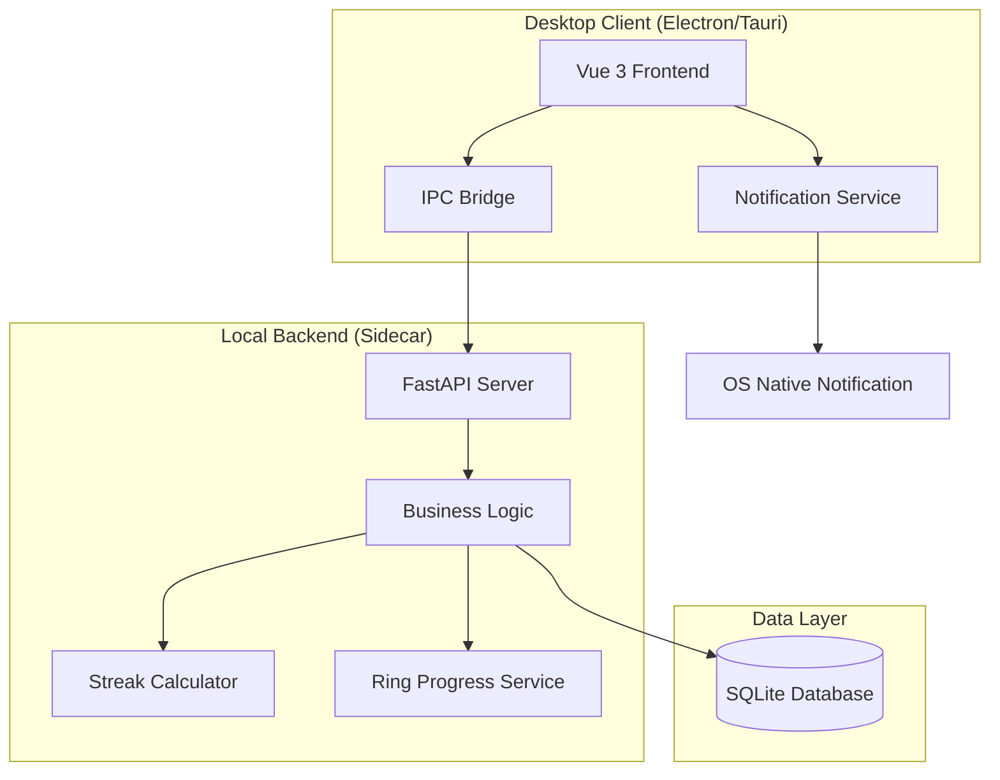
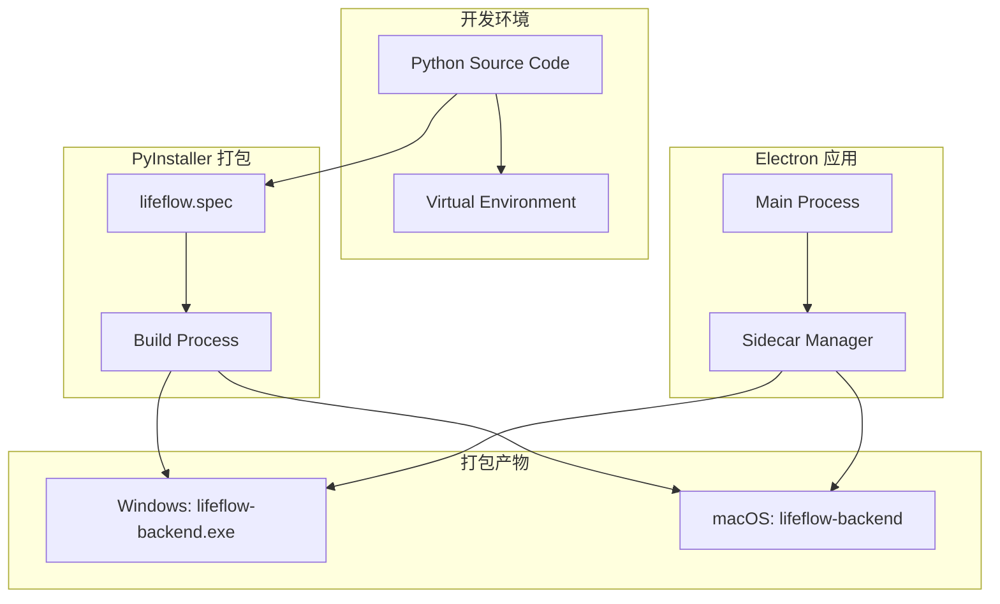
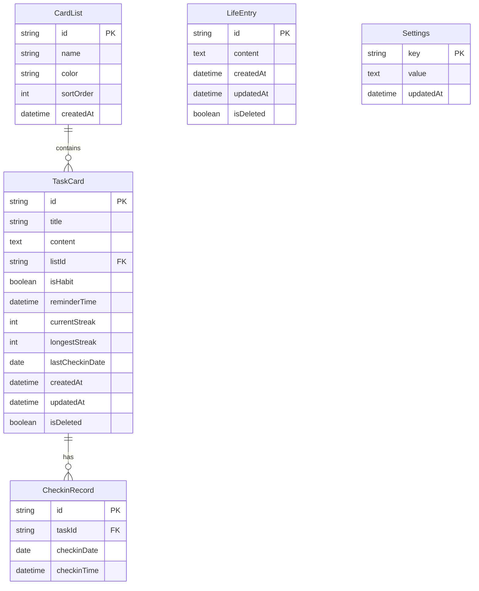

# Design Document: LifeFlow

## Overview

LifeFlow 是一款跨平台桌面效率应用，采用前后端分离的 Sidecar 架构模式。前端使用 Electron/Tauri 容器承载 Vue 3 应用，后端使用 Python FastAPI 作为本地 API 服务，数据持久化采用 SQLite。

系统核心设计理念是"卡片即一切"——任务、习惯、笔记都以卡片形式呈现，通过统一的数据模型和交互模式，实现"任务-习惯-生活"三位一体的用户体验。

## Architecture

### 系统架构图



### 架构决策

| 决策点 | 选择 | 理由 |
|--------|------|------|
| 桌面框架 | Electron | 生态成熟，Notification API 完善，跨平台支持好 |
| 前端框架 | Vue 3 + Vite + TypeScript | 组件化开发，响应式数据绑定，构建速度快 |
| 后端框架 | FastAPI (Python 3.13) | 异步支持好，自动生成 API 文档，Python 生态丰富 |
| Python 环境 | venv | 项目隔离，使用 `.venv` 目录 |
| 后端打包 | PyInstaller | 将 Python 后端打包为独立可执行文件，无需用户安装 Python |
| 数据库 | SQLite | 零配置，单文件存储，适合本地应用 |
| 前后端通信 | HTTP REST API | 简单可靠，便于调试 |

### 后端打包架构



### PyInstaller 配置策略

| 配置项 | 值 | 说明 |
|--------|-----|------|
| 打包模式 | `--onefile` | 生成单个可执行文件，便于分发 |
| 控制台 | `--noconsole` (Windows) | 隐藏控制台窗口 |
| 数据文件 | `--add-data` | 包含必要的数据文件 |
| 隐藏导入 | `--hidden-import` | 确保动态导入的模块被包含 |
| 图标 | `--icon` | 设置应用图标 |

### Sidecar 进程管理

Electron 主进程负责管理后端 sidecar 进程的生命周期：

```typescript
// Sidecar 管理器接口
interface SidecarManager {
  start(): Promise<void>;      // 启动后端进程
  stop(): Promise<void>;       // 停止后端进程
  restart(): Promise<void>;    // 重启后端进程
  isRunning(): boolean;        // 检查进程状态
  getPort(): number;           // 获取 API 端口
}
```

**进程启动流程：**
1. Electron 主进程启动时，检测打包后的后端可执行文件路径
2. 使用 `child_process.spawn` 启动后端进程
3. 等待后端 API 健康检查通过
4. 通知渲染进程后端已就绪

**进程终止流程：**
1. Electron 应用关闭前，发送终止信号给后端进程
2. 等待后端进程优雅退出（最多 5 秒）
3. 如果超时，强制终止进程

## Components and Interfaces

### 前端组件结构

```
src/frontend/
├── components/
│   ├── TaskCard/           # 任务卡片组件
│   │   ├── TaskCard.vue
│   │   ├── TaskCardEditor.vue
│   │   └── MarkdownEditor.vue
│   ├── CardList/           # 卡片列表组件
│   │   ├── CardList.vue
│   │   └── CardListSidebar.vue
│   ├── Dashboard/          # 仪表盘组件
│   │   ├── DailyRing.vue
│   │   └── Statistics.vue
│   ├── LifeEntry/          # 生活记录组件
│   │   ├── LifeEntryInput.vue
│   │   └── LifeTimeline.vue
│   └── Notification/       # 通知组件
│       └── NotificationService.ts
├── stores/                 # Pinia 状态管理
│   ├── taskStore.ts
│   ├── habitStore.ts
│   └── settingsStore.ts
├── api/                    # API 客户端
│   └── client.ts
└── views/
    ├── HomeView.vue
    ├── TasksView.vue
    ├── HabitsView.vue
    ├── LifeView.vue
    └── StatsView.vue
```

### 后端 API 接口

#### Task Card API

| Method | Endpoint | Description |
|--------|----------|-------------|
| GET | `/api/tasks` | 获取所有任务卡片 |
| GET | `/api/tasks/{id}` | 获取单个任务卡片 |
| POST | `/api/tasks` | 创建任务卡片 |
| PUT | `/api/tasks/{id}` | 更新任务卡片 |
| DELETE | `/api/tasks/{id}` | 删除任务卡片 |
| POST | `/api/tasks/{id}/checkin` | 任务打卡 |

#### Card List API

| Method | Endpoint | Description |
|--------|----------|-------------|
| GET | `/api/lists` | 获取所有卡片列表 |
| POST | `/api/lists` | 创建卡片列表 |
| PUT | `/api/lists/{id}` | 更新卡片列表 |
| DELETE | `/api/lists/{id}` | 删除卡片列表 |

#### Life Entry API

| Method | Endpoint | Description |
|--------|----------|-------------|
| GET | `/api/life-entries` | 获取生活记录（分页） |
| POST | `/api/life-entries` | 创建生活记录 |
| PUT | `/api/life-entries/{id}` | 更新生活记录 |
| DELETE | `/api/life-entries/{id}` | 删除生活记录 |

#### Statistics API

| Method | Endpoint | Description |
|--------|----------|-------------|
| GET | `/api/stats/overview` | 获取统计概览 |
| GET | `/api/stats/daily-ring` | 获取每日圆环数据 |
| GET | `/api/stats/streaks` | 获取连胜统计 |

### 接口数据结构

```typescript
// Task Card
interface TaskCard {
  id: string;
  title: string;
  content: string;          // Markdown content
  listId: string;
  isHabit: boolean;
  reminderTime?: string;    // ISO 8601 format
  currentStreak: number;
  longestStreak: number;
  lastCheckinDate?: string;
  createdAt: string;
  updatedAt: string;
  isDeleted: boolean;
}

// Card List
interface CardList {
  id: string;
  name: string;
  color: string;
  sortOrder: number;
  createdAt: string;
}

// Life Entry
interface LifeEntry {
  id: string;
  content: string;
  createdAt: string;
  updatedAt: string;
  isDeleted: boolean;
}

// Check-in Record
interface CheckinRecord {
  id: string;
  taskId: string;
  checkinDate: string;      // YYYY-MM-DD format
  checkinTime: string;      // ISO 8601 format
}

// Daily Ring Data
interface DailyRingData {
  date: string;
  totalHabits: number;
  completedHabits: number;
  percentage: number;
}

// Statistics Overview
interface StatsOverview {
  totalTasks: number;
  completedTasks: number;
  pendingTasks: number;
  completionRate: number;
  longestStreak: number;
  todayCheckins: number;
}
```

## Data Models

### 数据库 ER 图



### SQLite Schema

```sql
CREATE TABLE card_lists (
    id TEXT PRIMARY KEY,
    name TEXT NOT NULL,
    color TEXT DEFAULT '#3B82F6',
    sort_order INTEGER DEFAULT 0,
    created_at DATETIME DEFAULT CURRENT_TIMESTAMP
);

CREATE TABLE task_cards (
    id TEXT PRIMARY KEY,
    title TEXT NOT NULL,
    content TEXT DEFAULT '',
    list_id TEXT REFERENCES card_lists(id),
    is_habit BOOLEAN DEFAULT FALSE,
    reminder_time DATETIME,
    current_streak INTEGER DEFAULT 0,
    longest_streak INTEGER DEFAULT 0,
    last_checkin_date DATE,
    created_at DATETIME DEFAULT CURRENT_TIMESTAMP,
    updated_at DATETIME DEFAULT CURRENT_TIMESTAMP,
    is_deleted BOOLEAN DEFAULT FALSE
);

CREATE TABLE checkin_records (
    id TEXT PRIMARY KEY,
    task_id TEXT REFERENCES task_cards(id),
    checkin_date DATE NOT NULL,
    checkin_time DATETIME DEFAULT CURRENT_TIMESTAMP
);

CREATE TABLE life_entries (
    id TEXT PRIMARY KEY,
    content TEXT NOT NULL,
    created_at DATETIME DEFAULT CURRENT_TIMESTAMP,
    updated_at DATETIME DEFAULT CURRENT_TIMESTAMP,
    is_deleted BOOLEAN DEFAULT FALSE
);

CREATE TABLE settings (
    key TEXT PRIMARY KEY,
    value TEXT,
    updated_at DATETIME DEFAULT CURRENT_TIMESTAMP
);

-- Indexes for performance
CREATE INDEX idx_task_cards_list_id ON task_cards(list_id);
CREATE INDEX idx_task_cards_is_habit ON task_cards(is_habit);
CREATE INDEX idx_checkin_records_task_id ON checkin_records(task_id);
CREATE INDEX idx_checkin_records_date ON checkin_records(checkin_date);
CREATE INDEX idx_life_entries_created_at ON life_entries(created_at);
```


## Correctness Properties

*A property is a characteristic or behavior that should hold true across all valid executions of a system-essentially, a formal statement about what the system should do. Properties serve as the bridge between human-readable specifications and machine-verifiable correctness guarantees.*

Based on the acceptance criteria analysis, the following correctness properties have been identified for property-based testing:

### Property 1: Settings Round-Trip Consistency

*For any* valid settings object, saving the settings to the database and then loading them should produce an equivalent settings object.

**Validates: Requirements 1.3**

### Property 2: Task Creation Adds to List

*For any* valid task title (non-empty, non-whitespace) and any existing card list, creating a task with that title should result in the task existing in the specified list, and the list's task count should increase by one.

**Validates: Requirements 2.1, 2.6**

### Property 3: Task Update Persistence

*For any* existing task and any valid update (title change, content change, list change), applying the update and then retrieving the task should return the updated values.

**Validates: Requirements 2.2**

### Property 4: Soft Delete Exclusion

*For any* entity (task or life entry), after marking it as deleted, querying the active entities should not include the deleted entity, but querying all entities (including deleted) should still find it.

**Validates: Requirements 2.3, 8.4**

### Property 5: Task Move Updates List Association

*For any* task in list A and any different list B, moving the task to list B should result in the task's listId being B, the task appearing in list B's tasks, and not appearing in list A's tasks.

**Validates: Requirements 2.4**

### Property 6: Markdown Round-Trip

*For any* valid Markdown content, parsing the content into an AST and then rendering it back to Markdown should produce content that, when parsed again, yields an equivalent AST.

**Validates: Requirements 3.5, 3.6**

### Property 7: Check-in Creates Record

*For any* habit task, performing a check-in should create a check-in record with the correct task ID and current date, and the record should be retrievable.

**Validates: Requirements 4.1**

### Property 8: Streak Calculation Correctness

*For any* sequence of check-in dates for a habit task:
- If all dates are consecutive (no gaps), the streak should equal the number of dates
- If there is a gap of more than one day between any two consecutive check-ins, the streak should reset and only count from the most recent consecutive sequence
- Day boundaries should be determined by the user's local timezone

**Validates: Requirements 4.2, 4.3, 4.6**

### Property 9: Daily Ring Percentage Accuracy

*For any* set of habit tasks and their check-in status for a given day:
- The ring percentage should equal (completed habits / total habits) * 100
- If total habits is zero, percentage should be 0 (or 100, depending on design choice)
- Crossing midnight should reset the calculation to only consider the new day's check-ins

**Validates: Requirements 5.1, 5.5**

### Property 10: Statistics Calculation Accuracy

*For any* set of tasks and check-in records:
- Total tasks count should equal the number of non-deleted tasks
- Completed tasks count should equal tasks marked as completed
- Pending tasks count should equal total - completed
- Completion rate should equal (completed / total) * 100 (or 0 if total is 0)
- Longest streak should equal the maximum currentStreak or longestStreak across all habit tasks

**Validates: Requirements 7.1, 7.2, 7.3, 7.4**

### Property 11: Life Entry Creation with Timestamp

*For any* valid text content, creating a life entry should result in an entry with that content and a timestamp within a reasonable tolerance of the current time.

**Validates: Requirements 8.1**

### Property 12: Life Entry Reverse Chronological Order

*For any* set of life entries with different timestamps, retrieving the entries should return them sorted by createdAt in descending order (newest first).

**Validates: Requirements 8.2**

### Property 13: Life Entry Edit Preserves Original Timestamp

*For any* existing life entry and any content update, editing the entry should update the content and updatedAt timestamp, but preserve the original createdAt timestamp.

**Validates: Requirements 8.3**

### Property 14: Life Entry Date Grouping

*For any* set of life entries spanning multiple dates, grouping by date should partition entries such that all entries in a group have the same date (based on createdAt), and groups are ordered by date descending.

**Validates: Requirements 8.5**

## Error Handling

### 数据库错误处理

| 错误场景 | 处理策略 |
|----------|----------|
| 数据库文件不存在 | 自动创建新数据库，初始化 schema |
| 数据库文件损坏 | 备份损坏文件，创建新数据库，通知用户 |
| 写入失败 | 重试 3 次，失败后显示错误提示，数据保留在内存 |
| 并发写入冲突 | SQLite WAL 模式处理，应用层使用事务 |

### API 错误处理

| HTTP 状态码 | 场景 | 响应格式 |
|-------------|------|----------|
| 400 | 请求参数验证失败 | `{"error": "validation_error", "message": "...", "fields": [...]}` |
| 404 | 资源不存在 | `{"error": "not_found", "message": "..."}` |
| 500 | 服务器内部错误 | `{"error": "internal_error", "message": "..."}` |

### 前端错误处理

- 网络请求失败：显示 toast 提示，支持重试
- 数据加载失败：显示空状态 + 重试按钮
- 表单验证失败：字段级错误提示
- 未保存数据丢失风险：离开页面前确认提示

## Testing Strategy

### 测试框架选择

| 测试类型 | 框架 | 说明 |
|----------|------|------|
| 前端单元测试 | Vitest | Vue 3 官方推荐，与 Vite 集成好 |
| 前端组件测试 | Vue Test Utils | Vue 组件测试标准库 |
| 后端单元测试 | pytest | Python 标准测试框架 |
| 后端属性测试 | Hypothesis | Python 属性测试库，用于验证正确性属性 |
| API 测试 | pytest + httpx | FastAPI 测试客户端 |
| E2E 测试 | Playwright | 跨平台桌面应用测试 |

### 属性测试配置

- 每个属性测试运行最少 100 次迭代
- 使用 Hypothesis 的 `@given` 装饰器生成测试数据
- 测试注释格式：`# **Feature: lifeflow, Property {number}: {property_text}**`

### 单元测试覆盖

前端单元测试重点：
- Pinia store 的状态管理逻辑
- API 客户端的请求/响应处理
- 日期/时间工具函数
- Markdown 解析和渲染

后端单元测试重点：
- 连胜计算算法
- 每日圆环百分比计算
- 统计数据聚合
- 数据验证逻辑

### 测试数据生成策略

```python
# Hypothesis 策略示例
from hypothesis import strategies as st

# 生成有效的任务标题（非空、非纯空白）
valid_task_title = st.text(min_size=1).filter(lambda x: x.strip())

# 生成日期序列（用于连胜测试）
date_sequence = st.lists(st.dates(), min_size=1, max_size=30)

# 生成 Markdown 内容
markdown_content = st.text(alphabet=st.characters(blacklist_categories=('Cs',)))
```
